# Docling vs DoclingDotNet Benchmarks

This document contains empirical benchmarks comparing the execution speed and semantic accuracy of the upstream Python `docling` library against this pure-managed `DoclingDotNet` port.

## 1. Speed Comparison (End-to-End Execution)

The following benchmarks measure the average end-to-end execution time required to parse, layout, and extract text/semantics from representative document formats. 

**Methodology:**
- Both libraries were tasked with loading the file from disk, executing their default conversion pipeline, and emitting the final page structures in memory.
- A 1-iteration warmup was performed to ensure JIT/Python imports were loaded.
- Times are averaged over 10 sequential iterations on a single CPU thread.

| Document | Format | Python (`docling-parse` typed API) | .NET Port (`DoclingDotNet` C ABI) | Speedup Factor |
| :--- | :--- | :--- | :--- | :--- |
| `font_01.pdf` (3 pages) | PDF | ~2.01 s | **~1.02 s** | **~2x** |
| `Research_reports_guidance.pdf` (119 pages) | PDF | ~26.26 s | **~22.17 s** | **~1.2x** |
| `word_sample.docx` | DOCX | ~0.023 s | **~0.002 s** | **> 11x** |
| `wiki_duck.html` | HTML | ~0.143 s | **~0.010 s** | **> 14x** |

### Why the difference in speed?
1. **Zero-marshaling JSON Parsing (PDFs):** The upstream Python `docling-parse` wrapper builds thousands of tiny Python dictionaries representing characters, words, and bounding boxes. The managed `.NET` port bypasses object allocations entirely using `Span<T>` and `System.Text.Json` source generators, providing a modest 1.2x - 2.0x speedup by reducing GC pressure and serialization overhead over the identically shared C++ extraction library.
2. **No Pandas/Numpy Boxing (HTML/DOCX):** HTML and DOCX parsing in .NET using `HtmlAgilityPack` and `DocumentFormat.OpenXml` creates direct generic collections. This completely avoids the sluggish dictionary manipulation and Pandas DataFrame allocations prevalent in the upstream data normalization stages, yielding >10x speedups.

---

## 2. Accuracy & Semantic Parity

Because `DoclingDotNet` aims to be a drop-in replacement, we developed a rigid Semantic Parity Harness (`FS-001`) to continuously monitor behavioral drift.

Standard text diffing fails on complex AI outputs due to floating-point drift and unordered dictionaries. Instead, our harness evaluates:
- **Geometry Drift:** Intersection-over-Union (IoU) signatures on bounding boxes.
- **Text & Flow:** Sequence-sensitive hashes representing the exact reading order of text.
- **Non-Text Context:** Distribution matching for tables, images, hyperlinks, and shapes.

### Current Parity Results (vs. Python Ground Truth)
Run against the upstream regression corpus (25+ dense PDFs, including `complex_tables.pdf`, `font_01.pdf`, etc.):

| Severity Level | Threshold Definition | Current Drift Count | CI Status |
| :--- | :--- | :--- | :--- |
| **Critical** | Missing top-level schema elements or malformed JSON bounds. | **0** | Pass ✅ |
| **Major** | Text reading order mismatch, missing words, mismatched OCR injections. | **0** | Pass ✅ |
| **Minor** | Sub-pixel floating point drift (e.g., `0.1001` vs `0.1002`) due to OS math diffs. | **25** (Ignored) | Pass ✅ |

*The .NET port achieves **100% Major/Critical semantic parity** with the upstream Python implementation on the core PDF regression corpus.*

---

## Visual Summary

```mermaid
%%{init: {'theme': 'base', 'themeVariables': { 'primaryColor': '#4CAF50', 'secondaryColor': '#f44336'}}}%%
xychart-beta
    title "PDF Parsing Execution Time (Lower is Better)"
    x-axis "font_01.pdf"
    y-axis "Time (Seconds)" 0.0 --> 3.0
    bar [2.01]
    bar [1.02]
```

*(Left/Red: Python Docling. Right/Green: DoclingDotNet)*

```mermaid
xychart-beta
    title "Semantic Formats Execution Time (Lower is Better)"
    x-axis ["word_sample.docx", "wiki_duck.html"]
    y-axis "Time (Seconds)" 0.00 --> 0.15
    bar [0.023, 0.143]
    bar [0.002, 0.010]
```

*(Left/Red bars: Python. Right/Green bars: .NET)*